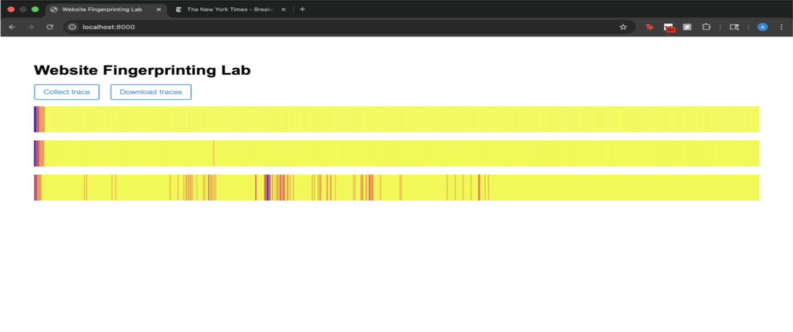

## Optional

**Report your browser version, CPU type, cache size, RAM amount, and OS. We use this information to learn about the attack’s behavior on different machines.**

- Browser: Chrome
- CPU: Apple M2 Pro
- Cache sizes: 131072
- RAM: 16 GB
- OS: MacOS Tahoe 26.2


## 1-2

**Use the values printed on the webpage to find the median access time and report your results as follows.**

| Number of Cache Lines | Median Access Latency (ms) |
| --------------------- | -------------------------- |
| 1                     | 0                          |
| 10                    | 0                          |
| 100                   | 0                          |
| 1,000                 | 0                          |
| 10,000                | 0.15000000596046448        |
| 100,000               | 0.30000001192092896        |
| 1,000,000             | 1.550000011920929          |
| 10,000,000            | N/a                        |


## 1-3

**According to your measurement results, what is the resolution of your `performance.now()`? In order to measure differences in time with `performance.now()``, approximately how many cache accesses need to be performed?** 
The resolution of my `performance.now()` is in the order of ~0.1ms.


## 2-2

**Report important parameters used in your attack. For each sweep operation, you access N addresses, and you count the number of sweep operations within a time interval P ms. What values of N and P do you use? How do you choose N? Why do not you choose P to be larger or smaller?**

##### N: 32,768 Cache Lines
For a full sweep, we wanted to completely fill the L1 and L2 cache. The approximate size of the L1 and L2 cache on my device is 32,768 Cache Lines. Any larger would introduce more noise, any smaller has the potential to miss data on when cache hits and misses take place.
##### P: 25ms
A larger P would smooth out the behaviour and not allow for resolution into small bursts or activity that can take place. A smaller P would increase sampling rate but would pick up potentially too much noise.


## 2-3

**Take screenshots of the three traces generated by your attack code and include them in the lab report.**




## 2-4

**Use the Python code we provided in Part 2.1 to analyze simple statistics (mean, median, etc.) on the traces from google.com and nytimes.com. Report the statistic numbers.**
#### google.com
Max: 804
Min: 158
Mean: 725.90375
Median: 773.0


#### nytimes.com
Max: 795
Min: 282
Mean: 624.51
Median: 548.5


## 2-6

**Include your classification results in your report.**

```
                          precision    recall  f1-score   support

   https://www.baidu.com       1.00      0.86      0.93        44
https://www.facebook.com       0.85      0.97      0.91        36
  https://www.google.com       0.94      0.92      0.93        36
 https://www.youtube.com       0.91      0.95      0.93        44

                accuracy                           0.93       160
               macro avg       0.93      0.93      0.92       160
            weighted avg       0.93      0.93      0.93       160
```


## 3-2

**Include your new accuracy results for the modified attack code in your report.**

```
                          precision    recall  f1-score   support

   https://www.baidu.com       0.97      1.00      0.99        38
https://www.facebook.com       1.00      1.00      1.00        39
  https://www.google.com       0.98      0.95      0.96        43
 https://www.youtube.com       0.95      0.95      0.95        40

                accuracy                           0.97       160
               macro avg       0.98      0.98      0.98       160
            weighted avg       0.98      0.97      0.97       160
```


## 3-3

**Compare your accuracy numbers between Part 2 and 3. Does the accuracy decrease in Part 3? Do you think that our “cache-occupancy” attack actually exploits a cache side channel? If not, take a guess as to possible root causes of the modified attack.**
The accuracy of the attack increases after removing the memory access lines from the `worker.js` file (pt. 2 ~ 0.93 accuracy, pt. 3 accuracy ~0.97 accuracy). The "cache-occupancy" attack takes advantage of the cache to develop fingerprints of websites, but it seems that other timing based side channels are at play here. Because ML models are a "black box" prediction model, it's difficult to pinpoint the root cause of the modified attack. The paper There's Always a Bigger Fish: A Case Study of Misunderstood Timing Side Channel shows this attack's success is attributed primarily to system interrupts.


